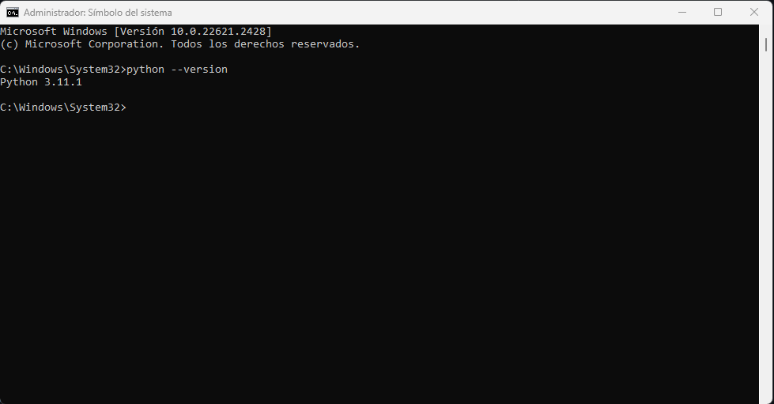

# Curso para aprender a programar con Python desde cero.

:snake: Python es un lenguaje de programación de alto nivel y de propósito general creado por [Guido Van Rossum](https://es.wikipedia.org/wiki/Guido_van_Rossum) a finales de los años 80s y fue liberado por primera vez el 20 de Febrero de 1991. Actualmente es uno de los lenguajes de programación más populares y más utilizados en todo el mundo debido a que es fácil de aprender, tiene una comunidad muy activa que desarrolla y da mantenimiento al lenguaje, librerías y herramientas; ya que Python es un proyecto de código abierto. 

Python se puede utilizar para crear software de: Inteligencia Artificial, Ciencia de Datos, Ingeniería de Datos, Ciberseguridad, Desarrollo de Videojuegos, Desarrollo Web, Internet de las cosas, Robótica, Etc.No importa si estás dando tus primeros pasos o si eres un programador experimentado. Python es el lenguaje que deberías aprender.


---
#### Configura tu equipo
---
1- Debes revisar si tienes instalado Python en tu equipo: escribe el siguiente comando en la interfaz de linea de comandos(Simbolo del Sistema en Windows).

```shell
python --version
```



Como puedes ver de la interfaz de linea de comandos, estoy usando la versión de Python 3.11.1 en este momemnto. Esto quiere decir que python está instalado en mi computadora. Puede ser que en tu caso muestre una versión diferente o no te muestre nada. Sino logras ver nada entonces debes instalar python.

2- Descarga de  [descargar](https://www.python.org/downloads/)


3- Para programar debes instalar un editor de texto o un IDE en tu computadora, en este caso te recomiendo que uses  [Visual Studio Code](https://code.visualstudio.com/)


---
#### ¿Qué es programación ?
---
La programación es el proceso de escribir un conjunto de instrucciones en un orden lógico que le dicen a una computadora cómo realizar una tarea. Escribir programas o programar es una actividad creativa y muy gratificante. Puedes escribir programas por muchas razones: diversión, porque deseas crear un videojuego, necesitas ayuda al hacer una tarea repetitiva.

---
#### Nuestro primer programa.
---

```py 
Print('Hola Mundo!')  # Imprime en la consola: "Hola Mundo!"
```

 :nerd_face: [Accede al Hola Mundo](./Codigo/holamundo.py)

---
### Ejercicios
---

Aqui encontrarás ejercicios donde podrás practicar Lógica de programación y mejorar tus habilidades de resolución de problemas.
Cada ejercicio propuesto tendrá una solución escrita en Python -> :computer: [Ejercicios](./Ejercicios/Ejercicios.md)